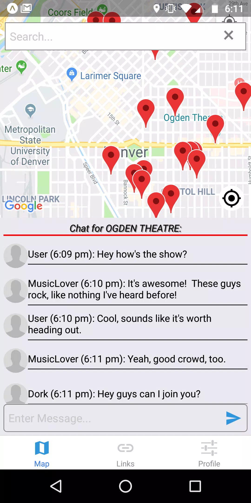
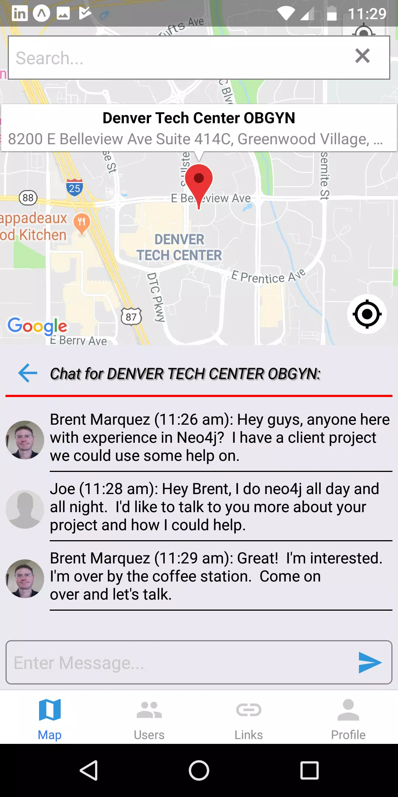
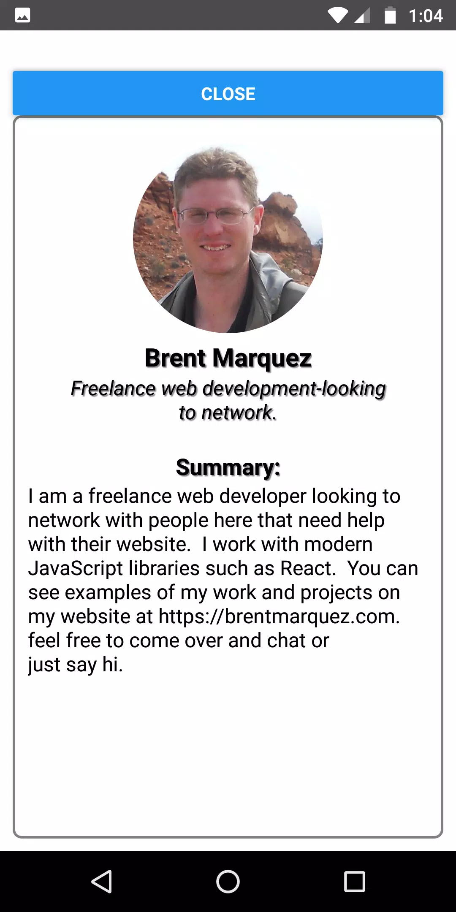
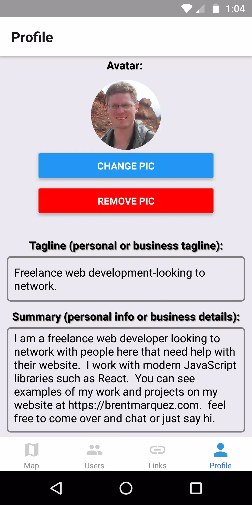

# HereHere

A place based real-time chat application built with React Native (Expo), Socket.io and consuming Google Places API with a Node.js backend and MongoDB for persistence.

- **NOTE:** This is app is no longer maintained or released.

     

## Components

- [HereHere-app](./HereHere-app/) (The React-Native app)
- [HereHere-server](./HereHere-server/) (Node.js backend server)

### Technologies used:

- React
- Redux
- redux-thunk
- Expo (using React-Navigation)
- Socket.io library to use WebSockets
- Node.js with Express and Mongoose
- MongoDB for persisting data
- Consumes Google Places API - \* You must have billing enabled for the project in GCP for this to work
- AWS S3 for storing profile photo and avatars
- Expo

### Features:

- Users search places via Google Maps API, select a location and chat live with other users who are there
- Socket.io for live chat over web sockets
- Search for any place and get auto suggestions through the Google Places API
- Login to save places or use the app without logging in
- Ephemereal chat messages which are cleared every 3 hours - get the latest info on what's going on at a place
- User profiles and photo/avatar
- Private messaging

## HereHere-server Node.js backend

- Node Backend API for Place Based Chat App HereHere

### Libraries and Technology used:

- [Express](https://expressjs.com/) framework for building server and API route controllers
- [Socket.io](https://socket.io/) for websocket integration
- Mongoose library (MongoDB integration)
- AWS JavaScript SDK for accessing AWS S3 services and buckets
