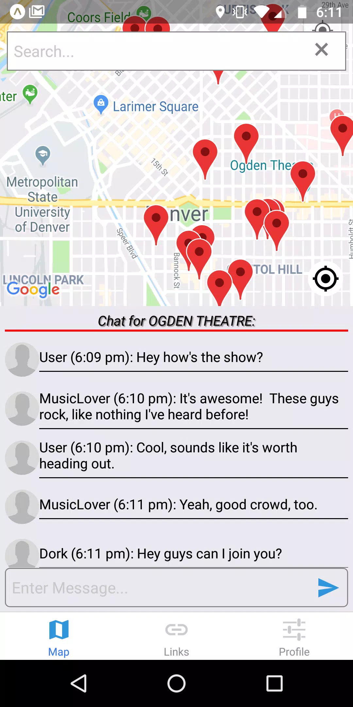
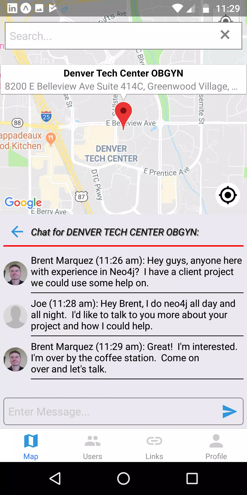
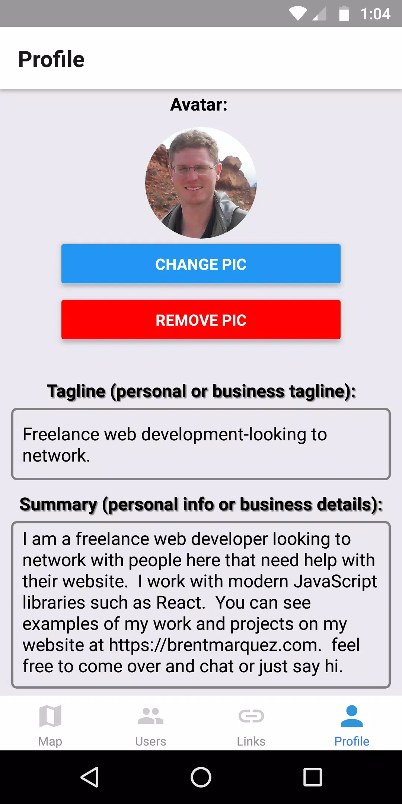

# HereHere

- A place based chat application built with React-Native for Android Mobile with a Node.js backend.
  - NOTE: This is app is no longer maintained or released due to lack of time to support the project

     

## Components

- HereHere-app
  - React-Native application built with Expo
  - React Redux, Redux-thunk
- HereHere-server
  - Node.js server using Mongooese
  - Socket.io for websocket chat functionality
